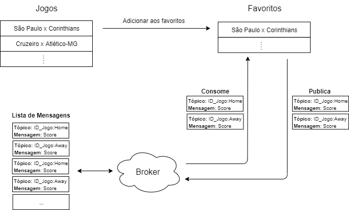

# Soccer Games

## Description

This project was developed for the discipline of distributed systems.

**Soccer Games** is a web system for responding to football matches (past, live and upcoming matches) separated by competitions.
It will also be possible to **favorite** a game and receive notifications of goals during the match.

There will be a screen for game responses. The games will be separated by competition and within each competition, separated by round.
In this way, a game can be *favorited*, appearing in the favorites menu.

NOTE: For reasons of limits from the application used to collect information about games, were considered the following competitions: Brasileirão, English Championship, Spanish, Italian, German and French.

## Architecture and Features

When a game is a favorite, the user passes a registration on the topic being registered with a broker. For this, CloudMQTT was used as a broker. The choice was made due to the author's prior knowledge on how to use the protocol / broker.

  

## Technologies/API

The technologies used were: ReactJS, NodeJS, HTML5 and CSS3.
For getting game information, it was used the **[football-data](https://www.football-data.org/)** API.

**[⚽ Access the Soccer Games](https://soccergames.netlify.com/)**
